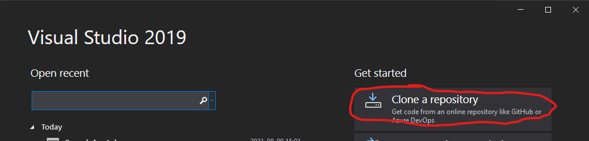
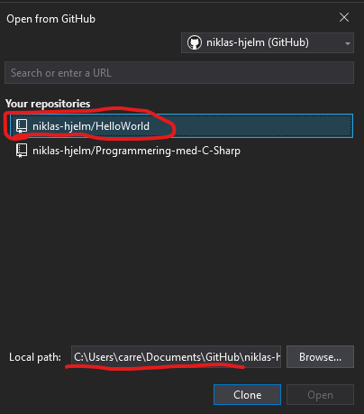
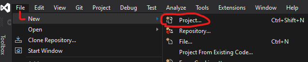
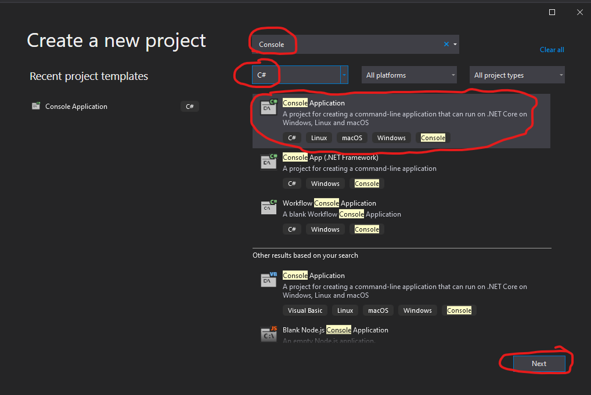
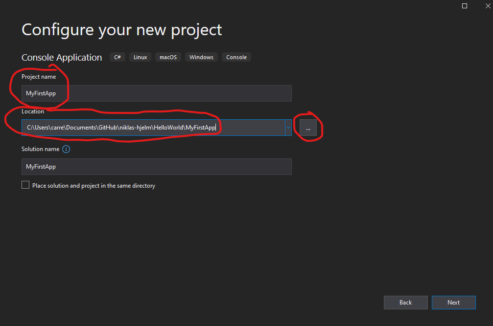

# Introduktionsövning Deadline 23/8-2021

1. Öppna [GitHub](https://www.github.com) och logga in med ditt nya konto.
2. Skapa ett nytt repository enligt [denna](./newRepo.md) beskrivningen.
3. Öppna Visual Studio 2019 Community och välj "Clone a repository". 
4. Välj det repository du precis skapat och se till att Local path ligger på rätt ställe(Jag föredrar att använda en mapp för alla repositorys som jag lägger i Documents och kallar GitHub) som bilden visar:  

5. Tryck på **"Clone"**
6. Nu väljer du **"File" -> "New" -> "Project"** 
7. Sök på **"Console"** och filtrera på **"C#"** och välj **"Console Application"** 
8. Tryck på **"Next"**
9. I nästa dialog sätt ett **"Project name"** och säkerställ att det hamnar på rätt ställe som bilden visar 
10. Tryck på **"Next"**